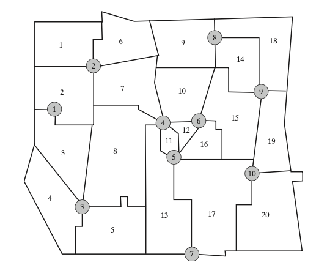
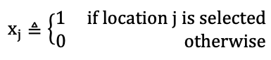
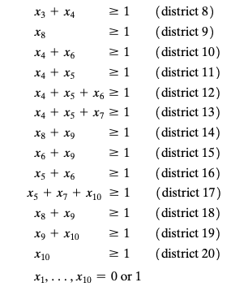

# Minimum Cover EMS Model

## Problem description

<figure align="center">
    
    <figcaption >Service District and Candidate Locations for EMS Application</figcaption>
</figure>


As always, it will help to think of a specific application. A classic example occurred when Austin, Texas undertook a study of the positioning of its emergency medical service (EMS) vehicles. That city was divided into service districts needing EMS services, and vehicle stations selected from a list of alternatives so that as much of the population as possible would experience a quick response to calls for help.
Figure shows the fictitious map we will assume for our numerical ver- sion. Our city is divided into 20 service districts that we wish to serve from some combination of the 10 indicated possibilities for EMS stations. Each station can provide service to all adjacent districts. For example, station 2 could service districts 1, 2, 6, and 7. Main decision variables are


<figure align="center">
    
</figure>

## Minimum Cover EMS Model

<figure align="center">
    
</figure>

<figure align="center">
    
</figure>


### Output
```
Objective value: 6.0
x = [0.0, 1.0, 1.0, 1.0, 0.0, 1.0, 0.0, 1.0, 0.0, 1.0]
```
|variables|value|
|---|---|
|Obj.| 6|
|x1|0|
|x2|1|
|x3|1|
|x4|1|
|x5|0|
|x6|1|
|x7|0|
|x8|1|
|x9|0|
|x10|1|
